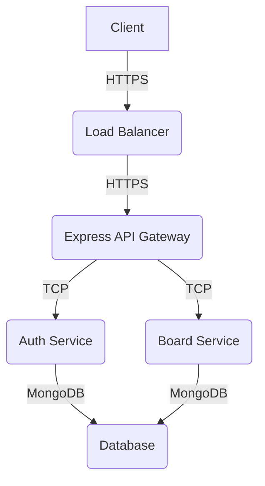

# Real-time Kanban Board API

A scalable, real-time Kanban board backend with database synchronization.

## Architecture

## API Endpoints

| Method | Path | Description | Auth | Roles | 
|---|---|---|---|---|
| POST | `/api/v1/auth/register` | Register a new user | No | N/A |
| POST | `/api/v1/auth/login` | Login a user | No | N/A |
| POST | `/api/v1/boards` | Create a new board | Yes | Admin |
| GET | `/api/v1/boards` | Get all boards | Yes | Admin, User |
| GET | `/api/v1/boards/:id` | Get a specific board by ID | Yes | Admin, User |
| PUT | `/api/v1/boards/:id` | Update a board by ID | Yes | Admin |
| DELETE | `/api/v1/boards/:id` | Delete a board by ID | Yes | Admin |
